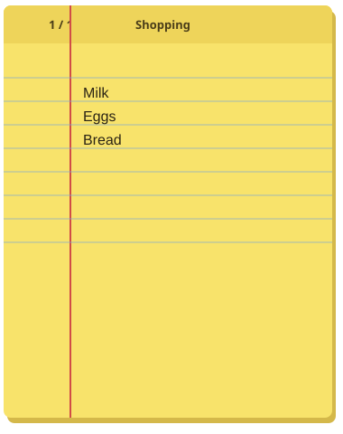

# Sticky Pad

A yellow legal-pad notebook that sits on the Linux desktop. Click it and type.
Pages, titles, and a **Pin** button to keep it on top — like a desklet, as a
plain GTK 3 window.



## Install

Needs Python 3, GTK 3, PyGObject, and cairo (`python3-gi`, `python3-cairo`,
`gir1.2-gtk-3.0`).

```bash
git clone https://github.com/burnt1983/sticky-pad.git
cd sticky-pad
./install.sh
sticky-pad
```

Notes save to `~/.config/lee-stickypad/notes.json`.

## Keys

| Shortcut | Action |
|---|---|
| `Ctrl+N` | New page |
| `Ctrl+PageDown` / `Ctrl+PageUp` | Next / previous page |
| `Ctrl+S` | Save now |
| `Ctrl+W` | Close |

Right-click the pad for New page, Delete this page, or Open notes folder.

Self-test:

```bash
python3 sticky_pad.py --self-test
```

## Desklet / panel (any Linux)

| Command | What you get |
|---|---|
| `sticky-pad --desklet` | Skip-taskbar pad stuck on the desktop |
| `sticky-pad --panel` | Smaller chip by the panel |

Works on GNOME, Cinnamon, MATE, XFCE, Budgie, LXQt, and KDE. Cinnamon: Settings → Desklets → Sticky Pad.

## Cinnamon spices store

This pad is a **keep-on-top GTK window**, so it already behaves like a Cinnamon
desklet on the desktop (GNOME, Cinnamon, MATE, XFCE).

To list it in **Cinnamon → Desklets** (the Linux Mint spices store) it would
need a second copy written in GJS, with a folder named `sticky-pad@burnt1983`
and a pull request to
[linuxmint/cinnamon-spices-desklets](https://github.com/linuxmint/cinnamon-spices-desklets).
That rewrite is not in this repo yet.

On Cinnamon today: run `./install.sh` and the pad appears at login.

## Uninstall

```bash
./uninstall.sh
```

Your notes file is left in place.

## Licence

MIT. See [LICENSE](LICENSE).
